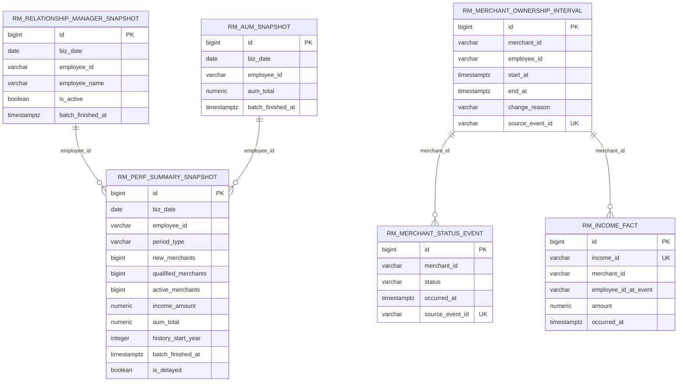

# Annual Performance Summary Data Design

## Source Assessment

The approved `annual-performance-summary` design is a T+1 reporting use case rather than an operational transaction flow. Page load requires P95 <= 2s and the summary API target is P95 <= 500ms, so the API should read precomputed snapshots instead of scanning facts on each request.

Expected source domains:

| Domain | Canonical table | Required fields | Notes |
|---|---|---|---|
| RM roster | `rm_relationship_manager_snapshot` | `biz_date`, `employee_id`, `is_active`, `batch_finished_at` | Batch driver table. Ensures RMs with no performance data still receive 0-valued snapshots. |
| Merchant ownership | `rm_merchant_ownership_interval` | `merchant_id`, `employee_id`, `start_at`, `end_at`, `change_reason`, `source_event_id` | Required for Q-4 count migration rules. Intervals must not overlap for one merchant. |
| Merchant status | `rm_merchant_status_event` | `merchant_id`, `status`, `occurred_at`, `source_event_id` | Supports Q-2: count merchants that ever reached qualified/active during the selected period. |
| Acquiring income | `rm_income_fact` | `income_id`, `merchant_id`, `employee_id_at_event`, `amount`, `occurred_at` | `employee_id_at_event` is frozen. Income does not migrate after merchant transfer. |
| AUM | `rm_aum_snapshot` | `biz_date`, `employee_id`, `aum_total`, `batch_finished_at` | P2 optional field. Missing data returns `null`. |
| Summary serving | `rm_perf_summary_snapshot` | two rows per RM per biz date: `current_year`, `all_time` | API reads latest rows through `rm_latest_perf_summary_snapshot`. |

## Pattern Selection

- Batch vs streaming: choose batch. Q-5 confirms T+1, and the UI does not require second-level freshness.
- Warehouse vs lakehouse: use a warehouse/serving schema for this feature. The workload is small, structured BI-style SQL with strict response-time needs, not ML or unstructured lake storage.
- Serving model: use `rm_perf_summary_snapshot` as a read-optimized fact snapshot. Recalculate idempotently by `(biz_date, employee_id, period_type)`.

## ER Diagram



## Aggregation Rules

All periods use Asia/Shanghai business time.

| `period_type` | Start | End |
|---|---|---|
| `current_year` | current year `01-01 00:00:00+08` | `biz_date 23:59:59.999999+08` |
| `all_time` | `2026-01-01 00:00:00+08` | `biz_date 23:59:59.999999+08` |

`new_merchants`:

- `current_year`: count distinct merchants whose onboarding interval starts in the period and is owned by the RM at onboarding time.
- `all_time`: count distinct merchants currently or period-relevantly owned by the RM from 2026 onward. Migrated-in onboarded merchants count for the receiver; migrated-out merchants no longer count for the original RM.

`qualified_merchants` / `active_merchants`:

- Count distinct merchants with at least one `status` event in the period while the merchant was inside the RM ownership interval.
- Repeated status changes count once.

`income_amount`:

- Sum `rm_income_fact.amount` by `employee_id_at_event` in the period.
- Merchant migration does not move earlier income to the receiving RM.

`aum_total`:

- Read the latest previous-day AUM row for `(biz_date, employee_id)`.
- Missing AUM maps to `null`; it must not fail the P1 summary.

## Snapshot Build SQL

The batch should run once per `:biz_date` after upstream data is complete. It writes one row per `(employee_id, period_type)`. The SQL below shows the core mouthful; production jobs may split it into staging CTEs.

```sql
WITH params AS (
    SELECT
        CAST(:biz_date AS date) AS biz_date,
        CAST(:batch_finished_at AS timestamptz) AS batch_finished_at,
        CAST(:source_batch_id AS varchar) AS source_batch_id
),
periods AS (
    SELECT
        'current_year'::varchar AS period_type,
        make_timestamptz(EXTRACT(YEAR FROM biz_date)::int, 1, 1, 0, 0, 0, 'Asia/Shanghai') AS period_start,
        (biz_date::timestamp + time '23:59:59.999999') AT TIME ZONE 'Asia/Shanghai' AS period_end,
        NULL::integer AS history_start_year
    FROM params
    UNION ALL
    SELECT
        'all_time',
        TIMESTAMPTZ '2026-01-01 00:00:00+08',
        (biz_date::timestamp + time '23:59:59.999999') AT TIME ZONE 'Asia/Shanghai',
        2026
    FROM params
),
employees AS (
    SELECT r.employee_id
    FROM rm_relationship_manager_snapshot r
    JOIN params p ON p.biz_date = r.biz_date
    WHERE r.is_active = true
),
new_counts AS (
    SELECT
        e.employee_id,
        p.period_type,
        COUNT(DISTINCT oi.merchant_id) AS new_merchants
    FROM employees e
    CROSS JOIN periods p
    JOIN rm_merchant_ownership_interval oi
        ON oi.employee_id = e.employee_id
       AND oi.start_at <= p.period_end
       AND COALESCE(oi.end_at, 'infinity'::timestamptz) > p.period_start
    WHERE (
        p.period_type = 'current_year'
        AND oi.change_reason = 'onboarded'
        AND oi.start_at BETWEEN p.period_start AND p.period_end
    ) OR (
        p.period_type = 'all_time'
        AND COALESCE(oi.end_at, 'infinity'::timestamptz) > p.period_end
    )
    GROUP BY e.employee_id, p.period_type
),
status_counts AS (
    SELECT
        oi.employee_id,
        p.period_type,
        COUNT(DISTINCT se.merchant_id) FILTER (WHERE se.status = 'qualified') AS qualified_merchants,
        COUNT(DISTINCT se.merchant_id) FILTER (WHERE se.status = 'active') AS active_merchants
    FROM periods p
    JOIN rm_merchant_status_event se
        ON se.occurred_at BETWEEN p.period_start AND p.period_end
    JOIN rm_merchant_ownership_interval oi
        ON oi.merchant_id = se.merchant_id
       AND oi.start_at <= se.occurred_at
       AND COALESCE(oi.end_at, 'infinity'::timestamptz) > se.occurred_at
    GROUP BY oi.employee_id, p.period_type
),
income_counts AS (
    SELECT
        i.employee_id_at_event AS employee_id,
        p.period_type,
        COALESCE(SUM(i.amount), 0)::numeric(18,2) AS income_amount
    FROM periods p
    JOIN rm_income_fact i
        ON i.occurred_at BETWEEN p.period_start AND p.period_end
    GROUP BY i.employee_id_at_event, p.period_type
),
aum AS (
    SELECT a.employee_id, a.aum_total
    FROM rm_aum_snapshot a
    JOIN params p ON p.biz_date = a.biz_date
)
INSERT INTO rm_perf_summary_snapshot (
    biz_date,
    employee_id,
    period_type,
    new_merchants,
    qualified_merchants,
    active_merchants,
    income_amount,
    aum_total,
    history_start_year,
    batch_finished_at,
    is_delayed,
    source_batch_id
)
SELECT
    p.biz_date,
    e.employee_id,
    period.period_type,
    COALESCE(n.new_merchants, 0),
    COALESCE(s.qualified_merchants, 0),
    COALESCE(s.active_merchants, 0),
    COALESCE(i.income_amount, 0),
    a.aum_total,
    period.history_start_year,
    p.batch_finished_at,
    p.biz_date < ((p.batch_finished_at AT TIME ZONE 'Asia/Shanghai')::date - 1),
    p.source_batch_id
FROM params p
CROSS JOIN employees e
CROSS JOIN periods period
LEFT JOIN new_counts n
    ON n.employee_id = e.employee_id AND n.period_type = period.period_type
LEFT JOIN status_counts s
    ON s.employee_id = e.employee_id AND s.period_type = period.period_type
LEFT JOIN income_counts i
    ON i.employee_id = e.employee_id AND i.period_type = period.period_type
LEFT JOIN aum a
    ON a.employee_id = e.employee_id
ON CONFLICT (biz_date, employee_id, period_type)
DO UPDATE SET
    new_merchants = EXCLUDED.new_merchants,
    qualified_merchants = EXCLUDED.qualified_merchants,
    active_merchants = EXCLUDED.active_merchants,
    income_amount = EXCLUDED.income_amount,
    aum_total = EXCLUDED.aum_total,
    history_start_year = EXCLUDED.history_start_year,
    batch_finished_at = EXCLUDED.batch_finished_at,
    is_delayed = EXCLUDED.is_delayed,
    source_batch_id = EXCLUDED.source_batch_id,
    created_at = now();
```

## Validation Checks

Run these checks before enabling the API flag:

```sql
-- 1. Ownership intervals must not overlap. The exclusion constraint should keep this empty.
SELECT a.merchant_id, a.id AS interval_a, b.id AS interval_b
FROM rm_merchant_ownership_interval a
JOIN rm_merchant_ownership_interval b
  ON a.merchant_id = b.merchant_id
 AND a.id < b.id
 AND tstzrange(a.start_at, COALESCE(a.end_at, 'infinity'::timestamptz), '[)')
     && tstzrange(b.start_at, COALESCE(b.end_at, 'infinity'::timestamptz), '[)');

-- 2. Snapshot uniqueness: exactly one row per employee/period/biz_date.
SELECT biz_date, employee_id, period_type, COUNT(*)
FROM rm_perf_summary_snapshot
GROUP BY biz_date, employee_id, period_type
HAVING COUNT(*) <> 1;

-- 3. API serving view must return the latest biz_date per employee/period.
SELECT employee_id, period_type, MAX(biz_date) AS expected_biz_date
FROM rm_perf_summary_snapshot
GROUP BY employee_id, period_type
EXCEPT
SELECT employee_id, period_type, biz_date
FROM rm_latest_perf_summary_snapshot;
```

## Implementation Notes

- The migration intentionally creates tables and a latest snapshot view only; data backfill and API cutover are separate steps.
- Use `DECIMAL(18,2)`/string DTOs end to end. Do not serialize monetary values through floating point.
- Cache keys must include `employee_id`, `period_type`, and latest `biz_date`.
- `type=qualified|active` is a front-end detail-list filter only. It must not change the summary API query.
